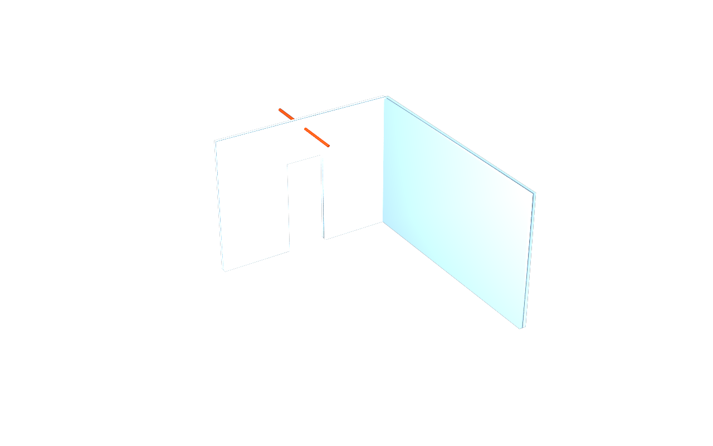

# usdAecoWall — wall drivers, with bodies from the authoring kernel

## Use case

A coordinator needs editable wall intent beside the body being reviewed.
Route K keeps axes, sections, joins and openings as drivers; an authoring
kernel produces the body. Read the [use case](docs/usecase.md) for the
workflow and the limits of the published data.

## The schema on an index card

| API | Applies to | Contract |
|---|---|---|
| `AecoWallAPI` | Imageable occurrences | 22 properties: location line, height, constraints, flags, joins and five derived quantities |
| `AecoOpeningAPI` | Imageable openings | 5 properties: host, filling, width, height and sill; seed of a future opening library |
| `AecoAxisAPI` (dependency) | Imageable occurrences | Local driving axis and derived length |
| `AecoBuildUpAPI` (dependency) | Catalog classes | Ordered section layers, composed through `inherits` |

The [schema](usdAecoWall/schema.usda) preserves all 27 wall/opening property
names, types, defaults, allowed tokens and derived flags from v0.1.2.

## The example

The published `clash` stage from `usdaeco-datacentre` v0.4.8 supplies
`demo-datacentre-01`. Wall promotion → L01 axis derivation → validation →
a bounds-framed corridor/meeting-room corner:

```sh
usdview examples/datacentre/result/example.usdc
```

[The committed result](examples/datacentre/result/README.md) is flattened
and self-contained; reviewing it needs only stock USD. Its five original
overlay layers remain available as text. Regeneration uses the pinned
environment below and `examples/datacentre/run.py --publish`.

[Inputs and results](examples/datacentre/README.md): 92 promoted walls,
3 equivalent single-layer types, 19 L01 axis guides and zero selected
validator findings. Published USD contains no join/opening records; those
counts are zero even though the tessellation contains door cuts. The
[small example](usdAecoWall/examples/minimal.usda) exercises actual L/T
join relationships and a hosted opening.



## Build and check

Use a Python environment with OpenUSD including UsdValidation, pytest,
numpy, packaging, jinja2 and Pillow. IFC fixture checks also need
IfcOpenShell. No editable install or setuptools import is required.
Use matching sibling checkouts from [dependencies.json](dependencies.json);
`AECO_CORE_ROOT`, `AECO_AXIS_ROOT`, `AECO_BUILDUP_ROOT`, `AECO_IFC_ROOT`,
`AECO_DATACENTRE_ROOT` and `TOOLCHAIN_DIR` override their locations.
Dependencies must already have built plugins; this repository never builds
or modifies siblings.

```sh
export PYTHON=python3
export PYTHONDONTWRITEBYTECODE=1
for pin in toolchain:v0.3.10 core:v0.9.5 axis:v0.1.5 buildup:v0.2.5 ifc:v0.2.2 datacentre:v0.4.8; do
  repo="usdaeco-${pin%:*}"
  mkdir -p "out/pinned/$repo"
  git -C "../$repo" archive "${pin#*:}" | tar -x -C "out/pinned/$repo"
done
export TOOLCHAIN_DIR="$PWD/out/pinned/usdaeco-toolchain"
export AECO_CORE_ROOT="$PWD/out/pinned/usdaeco-core"
export AECO_AXIS_ROOT="$PWD/out/pinned/usdaeco-axis"
export AECO_BUILDUP_ROOT="$PWD/out/pinned/usdaeco-buildup"
export AECO_IFC_ROOT="$PWD/out/pinned/usdaeco-ifc"
export AECO_DATACENTRE_ROOT="$PWD/out/pinned/usdaeco-datacentre"
export CORE_PLUGIN_DIR="$AECO_CORE_ROOT/usdAeco"
export AXIS_PLUGIN_DIR="$AECO_AXIS_ROOT/usdAecoAxis"
export BUILDUP_PLUGIN_DIR="$AECO_BUILDUP_ROOT/usdAecoBuildUp"
bash build.sh --generate-only
bash build.sh --install-root out
env -u PYTHONPATH "$PYTHON" examples/datacentre/run.py --publish
env -u PYTHONPATH PYTHONPATH="$AECO_CORE_ROOT:$PWD" "$PYTHON" check.py
env -u PYTHONPATH "$PYTHON" -m pytest -q
```

The six archives preserve the tested tags if sibling checkouts advance;
their committed flat plugin resources need no dependency rebuild. Each
revision in `dependencies.json` records the checked source commit; public
flake inputs resolve by tag because public releases have independent Git
history. The toolchain pin is v0.3.10, whose build input uses aeco-toolchain
v0.4.0. Library requirement ranges are unchanged. The standalone crate has
no external dependencies.

`usdrecord` must be on `PATH` for the CPU render. Core is registered first.
`CORE_PLUGIN_DIR`, `AXIS_PLUGIN_DIR` and `BUILDUP_PLUGIN_DIR` can name
explicit resource directories; both flat and old install layouts work.
`check.py` prints stage markers and the family `N checks, M failed` summary,
including raw S01–S29 results. It requires all eight core validators and
checks a seeded missing identity. See [status](docs/status.md) for measured
results and deviations.

```sh
nix flake check
```

The flake uses public release refs. For a local source mirror, use the
[toolchain's override policy](https://github.com/criad-com/usdaeco-toolchain/blob/main/docs/repo-conventions.md),
for example `--override-input core path:../usdaeco-core`; supply the other
pinned inputs similarly. Deployment registry and lock files stay local.

The CLI works directly from source:

```sh
env -u PYTHONPATH "$PYTHON" tools/aeco-wall import stage.usda --out out/wall.usda
env -u PYTHONPATH "$PYTHON" tools/aeco-wall import stage.usda --ifc source.ifc --out out/enriched.usda
env -u PYTHONPATH "$PYTHON" tools/aeco-wall validators
env -u PYTHONPATH "$PYTHON" tools/aeco-wall check out/wall.usda
```

`tools/aeco-wall-import` retains the original positional IFC interface.
Every import writes a new driver layer plus a separate `.derived.usda`
companion. Existing destinations are refused.

## Family

[Requirements](library.json): `usdAeco >=0.9,<1.0`, `usdAecoAxis >=0.1,<0.2`,
`usdAecoBuildUp >=0.1,<0.3`. Exact tested refs live in
[dependencies.json](dependencies.json). The
[family board](https://github.com/criad-com/usdaeco-board) presents the
library/use-case/example/check views. `usdaeco-sync` owns transactions;
integrations own kernel regeneration. `usdaeco-solid` supplies Route S;
`usdaeco-clash` is the shared showcase planned for wave 2.

## Layout

`usdAecoWall/` holds source, generated plugin, user docs and the small
example; `usdAecoWallValidators/` is the Python UsdValidation plugin.
`tools/usdaeco_wall/` provides queries, both import paths and CLI.
`testenv/` holds source-run tests and the previous-tag schema baseline.
`conformance/profiles/` holds severity policy. `docs/usecase.md` explains
Route K; `examples/datacentre/` records the pinned run. `out/` is transient.

## Status

Version **0.2.5** applies the six requested public release tags. The gate
passes **87 checks, 0 failed, 0 not run**; all **29 structure rules** and
**24 pytest tests** pass. Geometry and committed PNGs are unchanged.
Four public tag pages currently return HTTP 404; public installability
and a completed Nix build remain not proven.
[Release verification](docs/public-repin-verification.md) records the gate,
source-run tests, regenerated outputs and the single offline Nix attempt.
Earlier [public-name](docs/public-name-verification.md) and
[relocation](docs/relocation-verification.md) reports retain their historical
pins and measurements. Native regeneration and live round trips remain
outside this release.

## Licence

MIT. See [LICENSE](LICENSE). No third-party code is vendored here.
The importer imports IfcOpenShell, which is licensed under LGPL-3.0.
