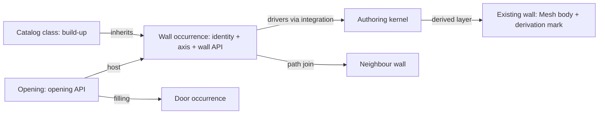

# Route K — walls as drivers, bodies from the authoring tool's kernel

## 1 The problem

A wall edit can change more than one body. A joined end may be trimmed
back, moving a neighbour may stretch the wall, and shortening a wall can
leave its opening outside the remaining span. Coordination needs both
the requested edit and the solver's result. A tessellation alone does
not describe the intent needed to regenerate a native wall.

This library makes that intent readable in USD. The authoring tool owns
the operation that rebuilds the body; a coordinator can inspect its
returned tessellation with an ordinary USD viewer.

## 2 The data as it arrives

IFC separates an `Axis` representation, a `Body`, a type-owned material
layer set and occurrence-specific layer usage. Path connections say
ATSTART, ATEND or ATPATH. Voiding and filling relationships connect a wall,
opening and door/window. A parametric authoring tool has corresponding
location curves, compound structures, constraints and hosted instances.

There are two import paths. `aeco-wall import stage.usda --ifc source.ifc`
reads material layers, usage, joins and cuts from IFC, matching existing
occurrences by `aeco:id`. Without `--ifc`, promotion uses only classified
USD elements and their `aeco:props:` properties. Its quantity contract is
SI metres, square metres and cubic metres; inputs in other units must be
normalized before promotion.

The published data-centre stage retains wall axes, type inheritance,
flags and quantities. It omits wall material-layer arrays, path joins and
opening referents. A reported width produces an **equivalent single
layer**, labelled as such, with function `other`, unknown material and
neutral priority. This is not evidence of the original construction.

## 3 The model in USD

A wall remains an Imageable with `AecoElementAPI`, its existing identity,
classification and spatial parent. `AecoWallAPI` decorates that occurrence.
`AecoAxisAPI` belongs to the axis library. `AecoBuildUpAPI` decorates an
abstract catalog class; `inherits` resolves its section onto occurrences.
No wall kind token or wall typed prim is introduced.

Editors author drivers only. Thickness, areas, volumes and resolved
build-up totals go into a separate derived layer; axis derivation writes
another layer. The core's `AecoDerivedGeometryAPI` marks output gprims
beneath their referent. The published body remains tessellated evidence.

`AecoOpeningAPI` stays here with its five published properties and
`aeco:opening:` namespace, as the documented seed of a future opening
library. A path join is a geometric constraint; network connectivity still
uses core ports. Existing identities and transforms are preserved.

## 4 Workflow

1. Obtain the exact releases in `dependencies.json`, including the
   already-published `clash` variant. Set `PYTHON`, `TOOLCHAIN_DIR` and
   `AECO_DATACENTRE_ROOT` as shown in the README.
2. Run `env -u PYTHONPATH "$PYTHON" examples/datacentre/run.py`. The shared
   harness composes input overlays over the pinned stage. The library hook
   calls the same promotion code as `aeco-wall import`, derives L01 wall
   axes with the `aeco-axis derive` implementation and runs validators.
3. Inspect `examples/datacentre/out/wall.drivers.usda`, its
   `.derived.usda` companion, `axis.derived.usda`, `findings.json` and
   `renders/partition_corner.png`. The source files remain unchanged.
4. For actual edits, author axis, section, constraint or join intent in a
   dedicated editing layer and use an integration through `usdaeco-sync`.
   Regenerate the affected closure of joined walls in the authoring tool;
   read back resolved drivers, quantities, diagnostics and bodies.
5. Accept the returned state only after checking diagnostics and the
   geometry. This example stops before a new kernel transaction: its
   bodies were produced by the pinned IFC publication pipeline.

## 5 Validation

The plugin keyword is `UsdAecoWallValidators`; full names are
`usdAecoWallValidators:<Rule>Checker`. The legacy callbacks are loaded
through `UsdValidation.ValidationRegistry` using `wrap_legacy`.

| Rule | Default | Catches |
|---|---|---|
| WallKindMismatch | warn | Wall API on incompatible IFC classification |
| WallMissingAxis | error | Missing API or unreadable axis endpoints |
| WallJoinAsymmetric | warn | A join without a reciprocal wall target |
| WallJoinedEndExtended | warn | Straight joined end more than 0.0001 m from the neighbour's plan face |
| WallOpeningOutsideHost | error | Opening width beyond its straight wall axis span |
| WallSizeMismatch | warn | Reported wall thickness differs from build-up sum by more than 1e-8 m |

ProperCase error tokens replace the old lower-camel spelling; severity
profiles still accept the old wall names. The default profile also runs
built-in USD checks. The example reports all wall/build-up findings and
axis findings for its selected L01 walls. It does not claim that the whole
published facility has no core or other-library warnings.

Tests seed every error, exercise rigid transforms and numerical tolerance,
verify SI promotion from metre and millimetre IFC, and compare the schema
against v0.1.2 using Sdf. Stage-only tests verify separate derived opinions,
unchanged inputs, missing-width reporting and refusal of conflicting type
widths. A fresh process checks plugin-free composition and fallbacks.

## 6 The example on the demo data centre

Facility `demo-datacentre-01`, release v0.4.8, variant `clash`. The runner
checks every published layer's size and SHA-256 against `dc.manifest.json`
and compares the whole-stage census to its counts. Base totals are read
from that manifest. It has no wall-specific census, so the following
observations come from the verified stage and are frozen in the expected
findings as regression evidence:

| Observation | Measured |
|---|---:|
| Promoted walls / reused axes | 92 / 92 |
| Equivalent build-up types | 3 |
| Promoted raw-property opinions blocked | 552 |
| L01 wall axis guides | 19 |
| Recorded join targets / opening APIs | 0 / 0 |
| Selected validator findings | 0 |
| Extent guides excluded from the review | 35 |

The render isolates `wall_l1_h_007`, its perpendicular partition
`wall_l1_v_016`, and `pipe_clash_hard`. These are published USD paths, not
new identities. Bounds determine the camera; the review layer controls
visibility and display colour. Room volumes with derivation role `extent`
are excluded before rendering with `guide,proxy,render` purposes.

The door cut visible in the mesh is not a promoted semantic opening. A
zero opening/join finding count in this input does not prove those rules
on real topology; the small fixture and IFC tests provide that coverage.
`--publish` explicitly updates committed imagery and manifest records.
Ordinary runs only write `out/`; expected findings are never overwritten.

## 7 Trade-offs and alternatives

Route K makes editing intent explicit and delegates joins, clips and
opening subtraction to an authoring kernel. It depends on an integration
for regeneration and on the body's tessellation for downstream geometric
measurement. An IFC file is a description; changing a driver alone does
not solve a constraint. A joined-end edit must account for the neighbour
and the join policy, then inspect the resolved result.

Route S, in `usdaeco-solid`, carries exact bodies in USD and measures
through the solid kernel. It can preserve exact representation evidence
without a wall driver set. Its trade-offs include kernel/plugin support,
export coverage and maintaining a renderable mesh twin for ordinary USD
viewers. Neither route replaces the core identity and representation mark.

**Clash detection is the shared showcase**, owned by `usdaeco-clash` in
wave 2. It will compare the same elements using mesh and exact evidence,
with tolerances and uncertainty reported explicitly. The crossing pipe
in this render illustrates the input case; this repository does not
compute or claim numerical clash findings.

## 8 Out of scope and open questions

No live integration was contacted. New native regeneration and round-trip
convergence are **NOT RUN** here. Exact-body evaluation, curved-join
validation, sloped/profiled walls, material wrapping and a complete opening
library remain outside this release. Stage-only promotion cannot recover
missing topology or the original compound construction from a width.

The library declares both wall and opening class prefixes and namespaces.
Toolchain v0.3.10 validates the retained `AecoOpeningAPI` contract through
the shared structure rules. See [status and deviations](public-repin-verification.md).

## 9 Status

Version 0.2.5 preserves the v0.1.2 schema contract and all 46 inherited
checks, and publishes the flattened example with its original layers and
a stock USD render.
[Measured status](public-repin-verification.md) records checks, tests, raw lint, Nix and the
remaining limitations. The schema plugin is codeless; validation is a Python
UsdValidation plugin. Outputs compose without family plugins.
