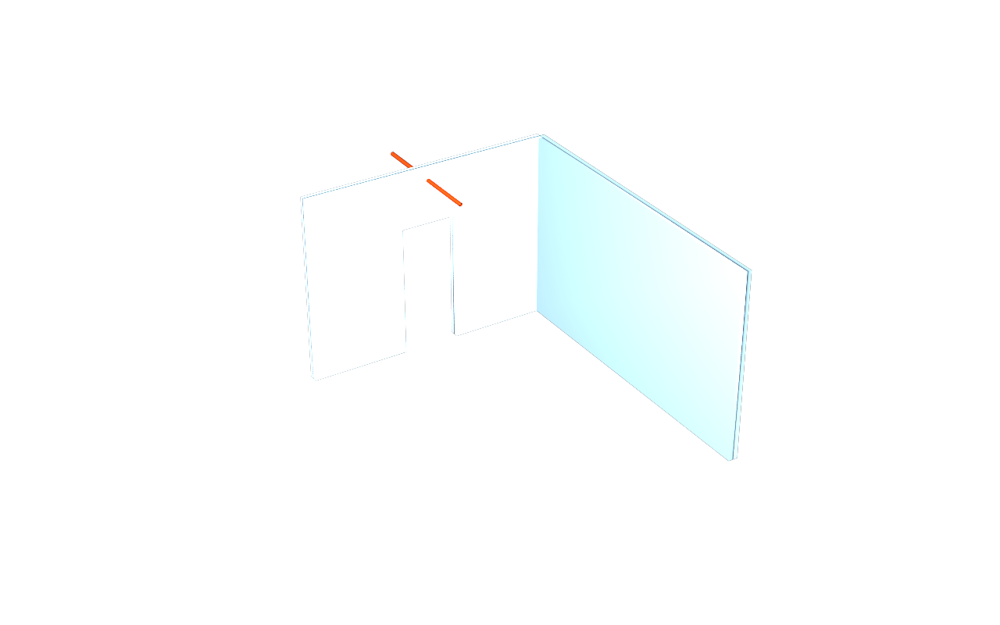

# Route K partition corner

Inputs: the published `dist/clash/dc.usda` and `dc.manifest.json` from
`usdaeco-datacentre` v0.4.5, plus [the camera](inputs/cameras.usda).
`AECO_DATACENTRE_ROOT` supplies the pinned source. Follow the
[pinned environment setup](../../README.md#build-and-check), which extracts
the exact tags without changing sibling checkouts.
No generator or converter is run. An explicit `AECO_DATACENTRE_STAGE`
compatibility override must retain its matching published manifest and
is recorded as `override`, never as pinned evidence.

```sh
usdview examples/datacentre/result/example.usdc
env -u PYTHONPATH "$PYTHON" examples/datacentre/run.py --publish
```

The [committed result](result/README.md) includes a flattened `example.usdc`,
five diffable layers and `vanilla.png`. The crate opens on its own with
stock USD, preserving all 12,375 prims, units, purposes and type fallbacks.
The archived overlays retain their original source-relative paths;
the crate is the standalone entry point.

The [hook](../../tools/usdaeco_wall/example.py) promotes classified wall
properties, derives the office-wing L01 axes, and validates wall/build-up
plus selected axis data. The entire published census is checked against
the manifest. Wall-specific observations are measured from that verified
stage because the publisher does not list them separately.

[Expected findings](expected/findings.json): 92 walls, 3 equivalent
single-layer types, 19 derived L01 axes, 0 recorded join targets, 0 opening
APIs, 0 selected validator findings. The 552 promoted raw opinions are
blocked in the overlay. Neither original material layering nor missing
topology is invented. The small [wall fixture](../../usdAecoWall/examples/minimal.usda)
and IFC checks exercise joins and openings.

Transient outputs are `out/example.usda`, `out/wall.drivers.usda`,
`out/wall.drivers.derived.usda`, `out/axis.derived.usda`, `out/review.usda`,
`out/findings.json`, `out/manifest.json` and `out/renders/`. Muting the
promotion and axis layers recovers the original semantics and bodies.
The separate review layer hides unrelated geometry and extent guides;
it never changes points, faces or element transforms.



The camera frames the composed bounds of two partitions and the hard-case
pipe. Final rendering uses Embree with `--purposes guide,proxy,render`.
Toolchain v0.3.5's shared harness renders default purposes first; the runner
then makes the explicit guide render and refreshes the final image records.
`--publish` updates `result/`, the committed image and [manifest](manifest.json),
including the userDoc copy; it never changes expected findings. Ordinary
runs write `out/result/`; `check_example()` compares it with the committed
result and rejects stale output. S27 opens the relocated crate without
plugins; S28 independently renders it using stock Embree with
`--purposes proxy,render` and checks the non-uniform image and size caps.

This is published tessellation evidence, not a new native regeneration or
a numerical clash test. Those integration/comparison rows remain NOT RUN.

The pinned runner creates the ignored `inputs/source` symlink from
`AECO_DATACENTRE_ROOT`. Select the exact release recorded in `dependencies.json`
when relocating the checkout, then run `run.py`. Archived layers reference the
source through `../../../inputs/source/dist/clash/dc.usda` from
`result/layers/out/`; links to other archived layers remain relative.
S29 checks these paths even before the symlink exists. The flattened
`result/example.usdc` remains immediately viewable without the source checkout.
